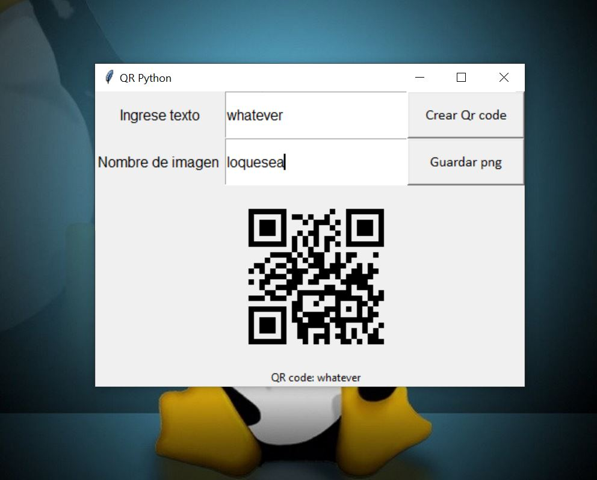

# Qr_python_Tkinter
Este es un programa para generar codigos qr con python y tkinter.

#step 1

No olvides! de instalar las dependencias:
Si estas en windows...
-> pip install pypng
-> pip install PyQRCode

#step 2

Importar las dependecias:
[*] from tkinter import *
[*] from tkinter import messagebox
[*] import os
[*] import png
[*] import pyqrcode

Copia el codigo del archivo generador_qr.py

